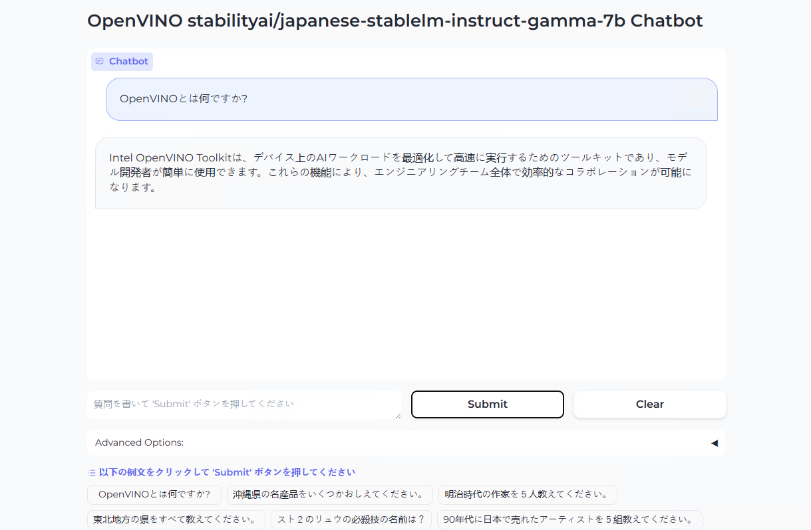

# JapaneseLLM ChatBot on Mobile PC
This script is for a demo of Japanese LLM Chatbot on Mobile PC. At the first, Convert [Stability AI Japanese 7B model](https://huggingface.co/stabilityai/japanese-stablelm-instruct-gamma-7b) to OpenVINO model and quantized, then use it as ChatBot engine on Gradio. After this conversion, the OV model is enough small size as running on Mobile PC.  
日本語LLMモデル [Stability AI Japanese 7B model](https://huggingface.co/stabilityai/japanese-stablelm-instruct-gamma-7b) をOpenVINO modelへのコンバートと量子化を行い、GradioのインターフェイスでチャットBOTとして利用します。モバイルPCでも利用可能な程度に軽量化をおこなっています。

# Recommended Configulation
- Intel(r) Core(TM) Ultra (Inference on CPU or GPU)
- 32GB System Memory (Can work on 16GB)
- Windows 11 x64
- Python 3.10 x64

# Setup
First, install required libraries on requirements.txt
> pip install -r requirements.txt

Then, starts SAILLM_OV.ipynb on Jupyter 
   

# Reference
- (HuggingFace/StabilityAI) [stabilityai/japanese-stablelm-instruct-gamma-7b](https://huggingface.co/stabilityai/japanese-stablelm-instruct-gamma-7b)
- (GitHub/yas-sim) [stabilityai--japanese-stablelm](https://github.com/yas-sim/stabilityai--japanese-stablelm)
- (GitHub/OpenVINO) [openvino_notebooks/notebooks/254-llm-chatbot](https://github.com/openvinotoolkit/openvino_notebooks/tree/main/notebooks/254-llm-chatbot)
